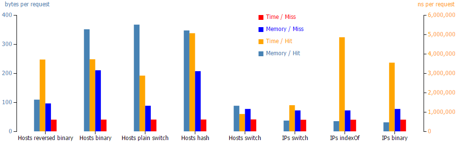

# Anti-censorship Solution for Russia on PAC-scripts

## Chrome Extension

See [WebStore](https://chrome.google.com/webstore/developer/edit/npgcnondjocldhldegnakemclmfkngch).
See [sources](https://github.com/ilyaigpetrov/anti-censorship-russia/tree/master/extensions/chromium/minimalistic-pac-setter), 

## Why I do This

I believe __information mustn't be blocked based on political or other subjective views__.
[See arguments against censorship (ru)](https://gist.github.com/ilyaigpetrov/9452b93ef3d7dd3d8cc2)

My maxim is "Your freedom ends when it starts to confine the freedom of others".

Looking at how Russian government [distorts TV](https://therussianreader.wordpress.com/2015/11/22/russian-truckers-strike-dagestan/) and blocks Internet, I decided to write an Anti-censorship extension for Chomium before they strike first.

For good or bad, Russian government blocks
[Main Kampf](https://en.wikipedia.org/wiki/Mein_Kampf) and
[critics of Putin](http://www.reuters.com/article/2014/03/13/us-russia-internet-idUSBREA2C21L20140313).

## PAC-script performance analysis

```javascript
if (Is_subdomain_of( host, blocked_hosts ))
  return 'use proxy';
```

You have to make `Is_subdomain_of` very fast.  
This check is executed on each request. You should watch memeory consumption too.

The naive solution is to keep array of blocked ips and check if the host resolves to one of the ips.  
You may do it with `indexOf`, binary search, etc.  
The shortcoming of every ip solution is that __some providers resolve blocked hosts to wrong ips__, so we eventually need list of hosts.

I have tested different solutions, and depicted [results](./benchmark/Output.txt) in the following chart:



* __IPs indexOf__ – Blocked IP is searched by `indexOf`
* __IPs binary__  – Blocked IP is searched by binary search. For some reason miss time slightly increased.
* __IPs switch__  – Simply `switch(Blocked_IP) { case1: ... caseN: return true }`. Works even better than binary search. Magic.
* __Hosts switch__ – Radix trie built on `switch`. Comparable to __IPs switch__.

